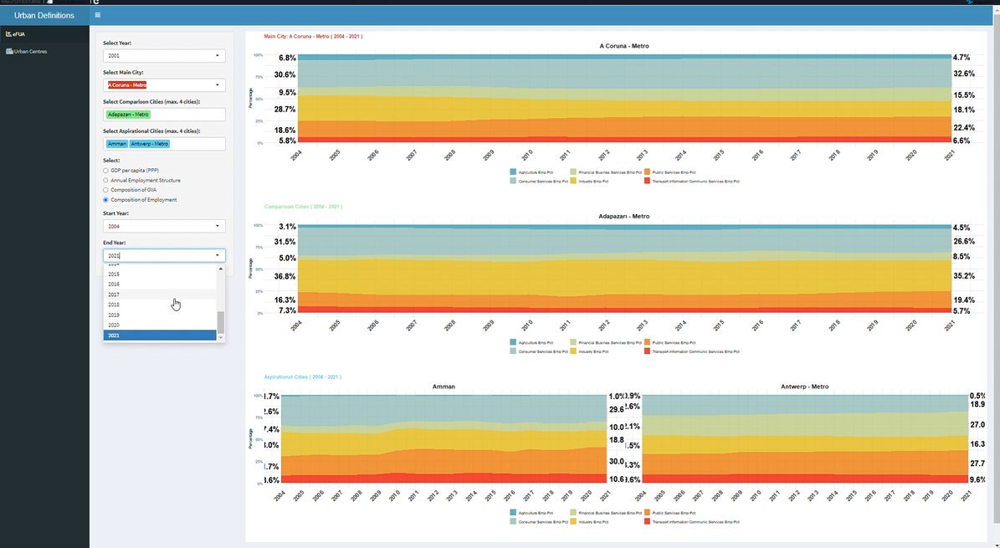

# Objective
----------

This project for the World Bank aims to construct a user-friendly Shiny app for visualising the economic structural characteristics of cities worldwide, based on varying urban definitions. 
Future versions will expand to include additional variables and datasets, as well as features such as graph downloads and interactive maps for comparing different definitions. Automatic report generation is also being considered as a potential enhancement.

[🎬 Watch the demo](https://github.com/Andrei-WongE/shiny_geo/releases/tag/1.0-Beta)




# How to use
----------

## Prerequisites

- R (version 4.5 or higher)
- RStudio
- Git

## Installation and Setup

1. **Clone the repository using Rstudio**
   - Open RStudio and introduce in the termnial the following code:
   ```bash
   git clone https://github.com/Andrei-WongE/shiny_geo.git
   ```

2. **Open in RStudio**
   - Go to File → Open Project.
   - Navigate to the cloned `shiny_geo` folder.
   - Select `shiny_geo.Rproj`.


## Running the App

1. **Launch the application**
   - Open the main app file (`app.R`).
   - Click the "Run App" button in RStudio (top right corner of the script editor).
   - Alternatively, run in R console:
   ```r
   shiny::runApp()
   ```

2. **Using the interface**
   - Choose urban definitions for analysis (tabbed interface).
   - Select countries from the dropdown menu.
   - Pick variables to visualize economic structural characteristics.
   - Explore the generated visualizations and data tables.

## Features

- Interactive visualization of city-level economic data
- Multiple urban definition comparisons
- Country selection and filtering
- Data tables for detailed analysis

## Nex steps
 - Include buttons to download graphs.
 - Add more variables and datasets.
 - Implement interactive maps for comparing different urban definitions.
 - Consider automatic report generation.
 - Optimize performance for larger datasets.
 - Enhance user interface for better usability.

